# 虚拟现实技术在教育领域中的应用
## 一、背景说明
经过前期针对虚拟现实在教育领域中应用的调研，我们可以了解到VR对于易班来说是一个新的契机和挑战([VR技术在教育领域中的应用.pdf](./doc/VR技术在教育领域中的应用.pdf)、[参考视频](https://www.google.com/edu/expeditions/#how-it-works))
在本次课题研究的下半阶段，我们结合易班的实际需求进行产品原型的设计和制作。希望感兴趣的老师对整个VR产品设计制作过程有个初步的了解，也为易班的VR领域的研究开一个头。欢迎大家关注本项目地址，有兴趣的同事可以在此项目的基础上迭代：http://gitlab.yiban.co/xyx/vr_research

## 二、产品设计

由于目前开学在即，我们希望为即将步入校园的新生打造一款VR产品，帮助新生解决实际的问题。

### 2.1 用户画像


** 准大学生 小明 **

* 准大学生，无收入人群
* 家住小县城，没有来过上海
* 过两个周就要来同济大学报道了
* 对大学生活充满欣喜和好奇
* 对陌生的大城市也有担心
* 非常想先熟悉一下学校环境
* 试过了百度地图、搜索一些关于学校的资料
* 但是一直没有好的办法

** 新生家长 老王 **

* 为孩子被大学录取而高兴
* 但是想到孩子要离开自己的身边而忧伤
* 很希望孩子能适应新的环境
* 希望孩子能平安到学校报到
* 希望能够了解一下孩子的学校环境怎么样


** 辅导员 **

* 即将开学，对于迎新需要提前做好准备；
* 学生和家长的咨询电话日益增多，但问的问题都类似；
* 迎新那天总会出点小状况，比如有学生对来学校的路线不熟迷路了


### 2.2 价值主张

在家就能完成身临其境地完成预报到

* 通过趣味游戏的方式，让学生了解校园环境
* 在家熟悉校园环境和报到流程
* 确保学生的安全：避免来校当天走失和迷路的情况
* 提升报到的效率，减少老师的工作量

#### 使用场景举例：
在收到入取通知书后，新生扫一扫通知书上的二维码，就可以下载本校迎新的APP。在手机上安装成功以后就可以把手机装入VR眼镜盒进行浏览。当新生真正到学校的时候，其实已经较为熟悉的了解自己学校的。

### 2.3 功能规划
目前，本课题完成了第一项功能：识别校园中的建筑物；
- [x] 识别校园中的建筑物：作为一名新生，我需要了解学校中的主要建筑物，以便我在家就能熟悉学校的地理环境少走弯路。
- [ ] 在校园中移动穿行
- [ ] 导览解说
- [ ] 做报到任务获奖励，例如，从机场/火车站到学校的任务，去宿舍报到的任务；

### 2.4 技术选型
目前许多厂商都推出了自己的VR解决方案，综合考虑制作成本、学习难度之后，我们选择了 Google Cardboard 的方案。
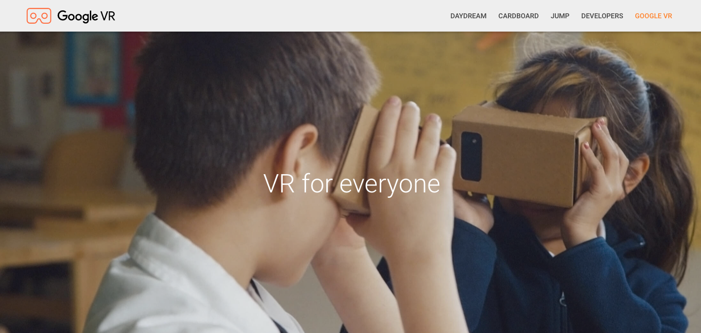

#### 2.4.1 头戴设备
Cardboard的眼镜成本低廉制作简单，可以自行用纸板制作，也可以从某宝购买，售价从几元到数十元不等。
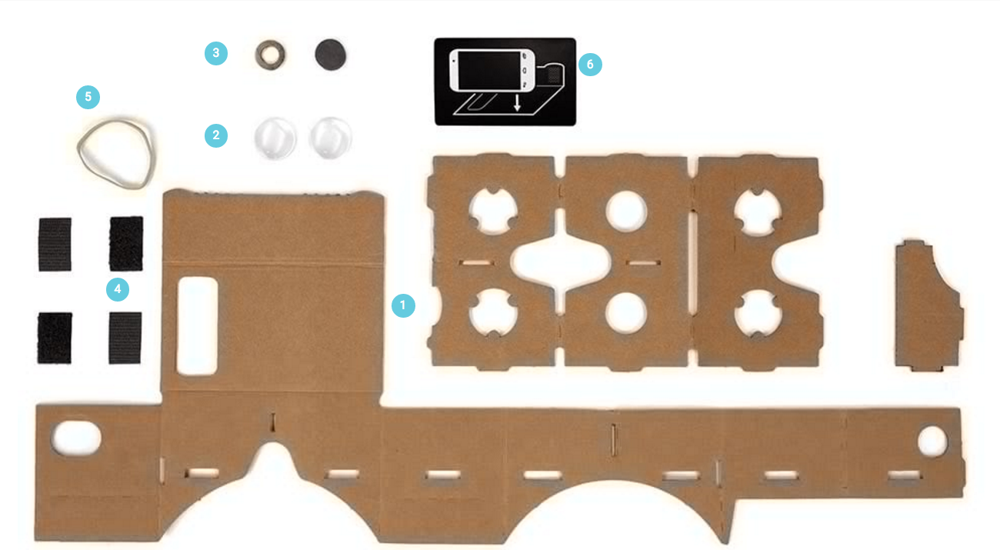
参考网站 [https://vr.google.com/intl/zh-CN_cn/cardboard/manufacturers/](https://vr.google.com/intl/zh-CN_cn/cardboard/manufacturers/)


访问该网站需要翻墙，请自行解决。这里提供了部分资料。

#### 2.4.2 内容制作
目前，基于谷歌的VR方案，可以通过以下方式制作内容：

1. **视频录制及合成：** 视频录制解决方案也是由多台摄影设备拼接而成，根据不同的需求选择不同的摄影设备。因此，成本也在几万到上百万不等，录制的后期合成也要花费多人力成本。
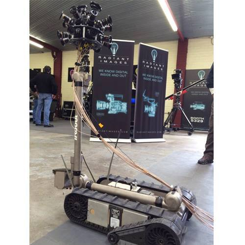

谷歌的Jump是性价比较高的方案，它是由16个GoPro 4组成的360圆盘，这些GoPro可以同时完成摄影工作。如图：
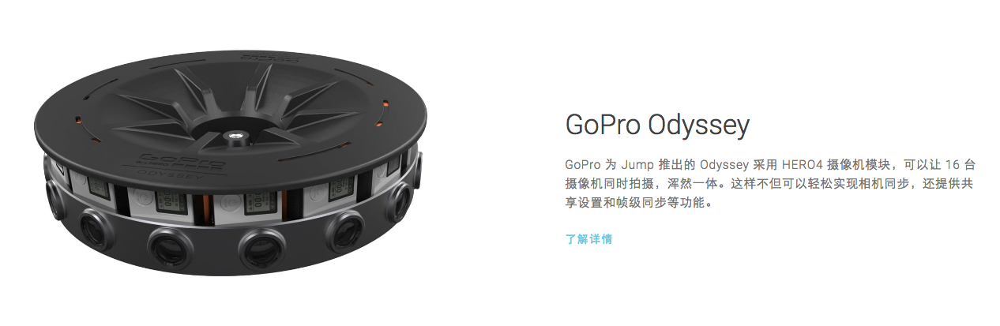
一个GoPro4市场价在4000元左右，因此该Jump的整个成本大概7~8万元。这个方案在众多方案算是性价比较高的。但另外缺点是由于Jump是环状上下可视范围只有120°。也就是说你可能是看不到头顶太阳。
2. **程序开发：**目前谷歌提供VR方案，主要有基于Android的Daydream SDK和能够兼容Android和iOS的Cardboard SDK
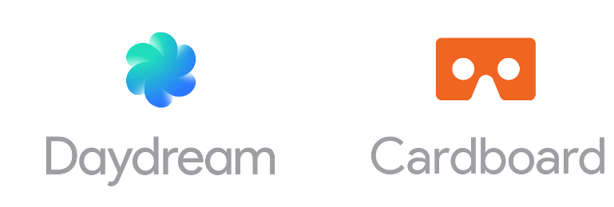

综合考虑，在原型制作阶段我们可以使用Cardboard进行低成本简单的虚拟场景制作，而后期条件宽裕的时候可以使用Jump进行制作。Cardboard SDK 实际上是Unity3D的素材库，提供了用于VR制作相关素材和脚本。因此这对熟悉Unity3D的开发者门槛较低。而且Unity3D的脚本主要使用了简化的C#和JavaScript。因此，对于有编程经验的开发者，上手也不难。


## 三 技术实施
本原型，我们需要实现的功能是当用户看到建筑物的时候在屏幕上显示出该物体的名称。
### 3.1 准备
Google对Cardboard SDK 的有充分的介绍，你可以参考这个[文档](https://developers.google.com/vr/concepts/overview-cardboard) 。
在目前我们需要做好以下准备：

* 下载最新的版本的Unity 3D。安装时候需要注意**选择支持安卓导出或者iOS（主要看你针对的平台）** 如何下载和安装可以看[这篇文章](http://www.ceeger.com/forum/read.php?tid=23396)
* 下载 Cardboard SDK for Unity，原版[下载地址](https://github.com/googlevr/gvr-unity-sdk)。因为，文件较大从外网下载到本地要花较长时间。幸运的是我已经把整个包上传到百度云了[下载地址](https://pan.baidu.com/s/1slRCC7F)。
* 下载安装最新版的 X-Code（针对iOS开发），如果你是Android那就下载Android的
SDK。

大家可以发现不管是Android还是iOS，都是用相同的Cardboard SDK for Unity，因此在基本开发流程上没有太大区别。本文接下去只以iOS为例。安卓党如有问题请自行谷歌。

### 3.2 开动
1. 打开Unity 3D创建一个名为VR_School的项目，并且确保选择的项目类型是3D；
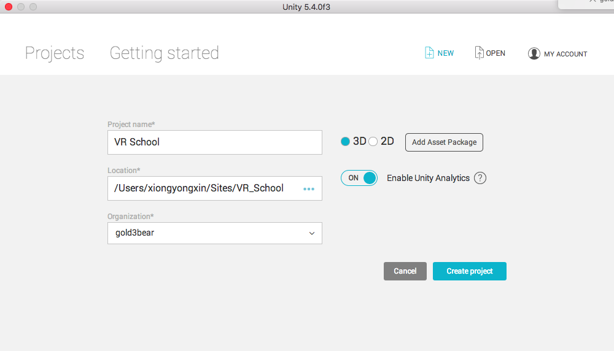

2. 导入Google Cardboard SDK，选择 GoogleVRForUnity.unitypackage后点击import
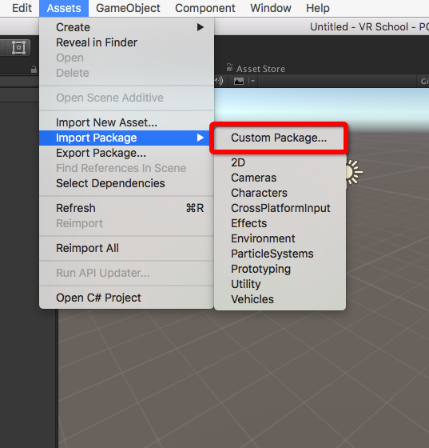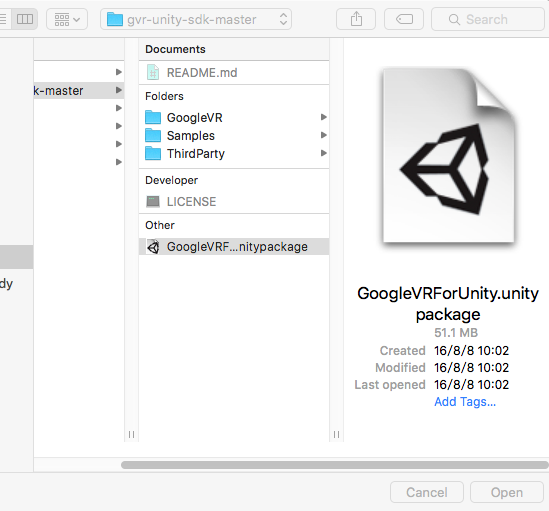

3. 创建在Assets中创建一个新的文件夹 MyAssets。这个文件夹主要用来放置我们自定义的素材
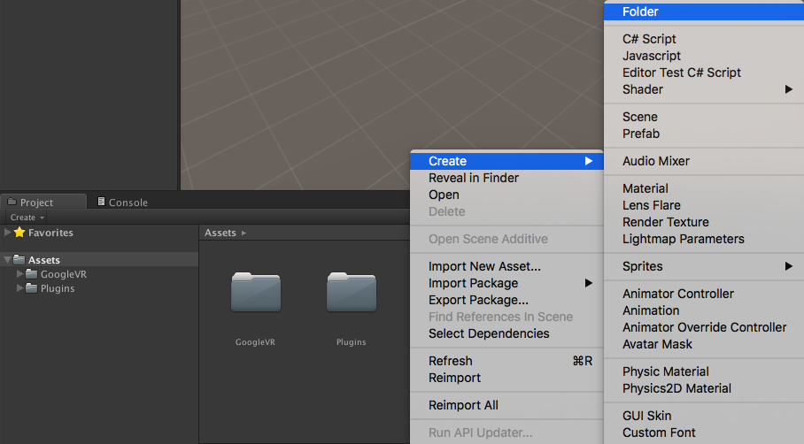

4. 在MyAssets中创建Scene文件夹，用来存放我们的场景文件。点击保存按钮（command+s），将文件当前文件存储，命名为stage。
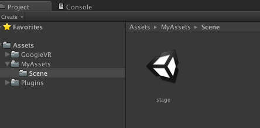

### 3.3 创建物体
1. 创建地面

    * 右键点击3D Object，选择Plane。
     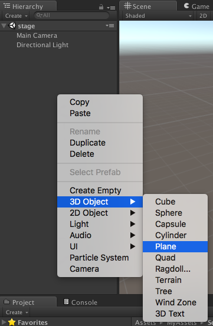
    * 选择平面，将其命名为 Ground，Transform中的参数Scale 设置为x=10,y=0,z=10
     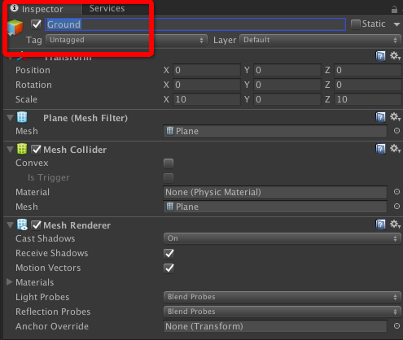
   
2. 创建建筑：
    * 建筑可以从3dsMAX、SketchUp或者Maya导入。为了简化操作我们用Unity自带的长方体代替。点击右键选择3D Object，选择Cube:
    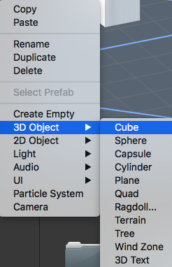
    * 设置Cube的参数：
         * 名称:教学楼
         * Position:x=0,y=1,z=0; 
         * Scale: x=1,y=2,z=1;
         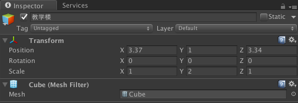

    * 将“教学楼”复制出3个出来，调整不同的位置、高度和大小以示区分，注意调整Y坐标高度使底部贴地
     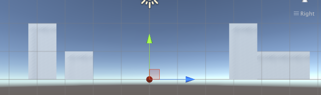
    * 分别命名为体育馆、宿舍楼、食堂；
     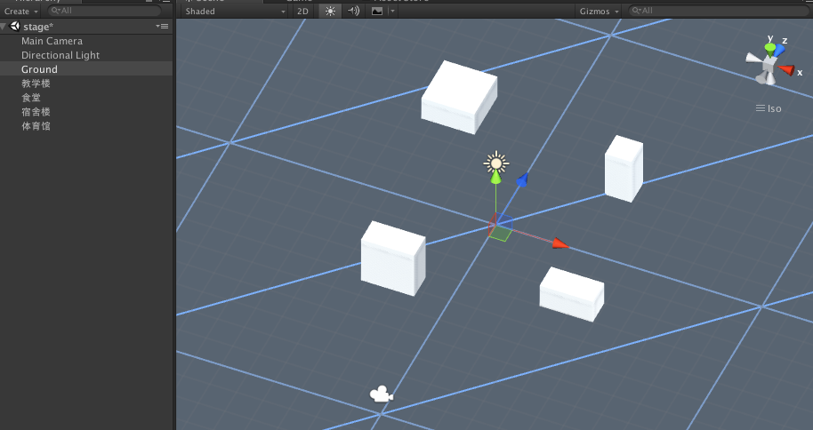

3. 添加素材
    我们现在要给场景中的物体附上材质，让地面、建筑物有不同的颜色：
    * 在“MyAssets”中创建名为“Materials”文件夹：
    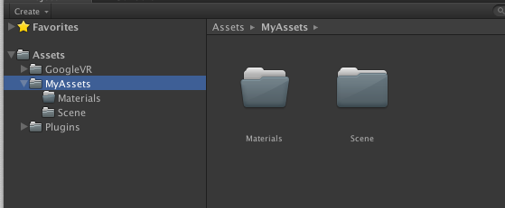
    * 创建用于地面的一个材质球，命名为GroundMaterial，并且选择好颜色；
    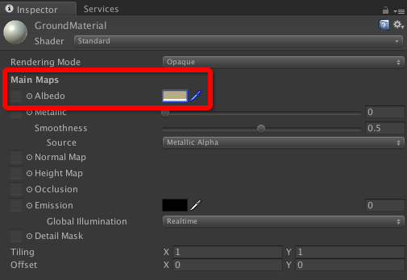
    * 创建用于建筑物的4个材质球，分别命名为：BuildingMaterial、BuildingMaterial1、BuildingMaterial2、BuildingMaterial3，配上不同的颜色来区分；
    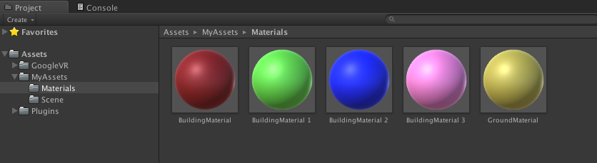
    * 分别将这5个材质拖动到对应的物体上面
    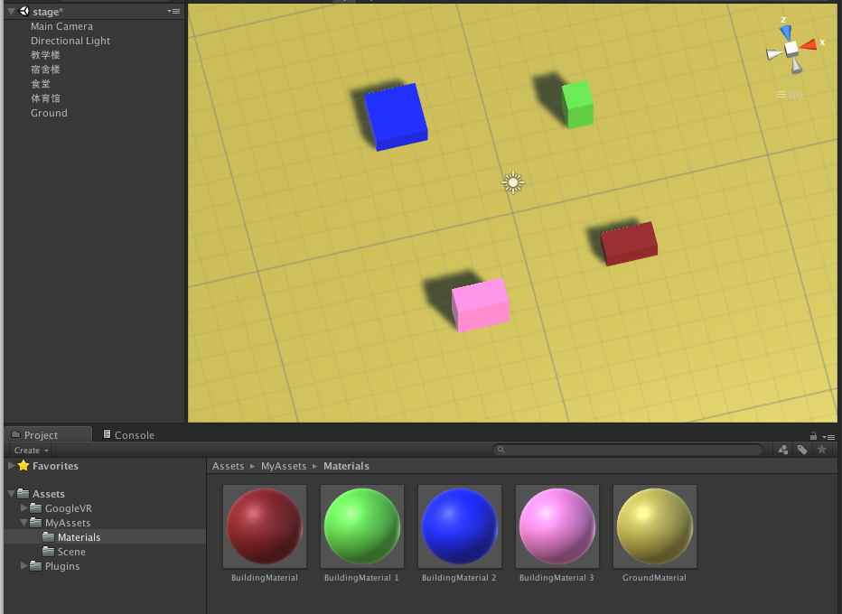

### 3.3 设置相机

1. 我们这一步是需要将相机放这4个建筑物的中间。选中相机，你可以在小窗口上看到相机视角。相机的Position 参数可以设置为：x=0,y=1,z=0;这样相机就移动到4个物体的中间了。
    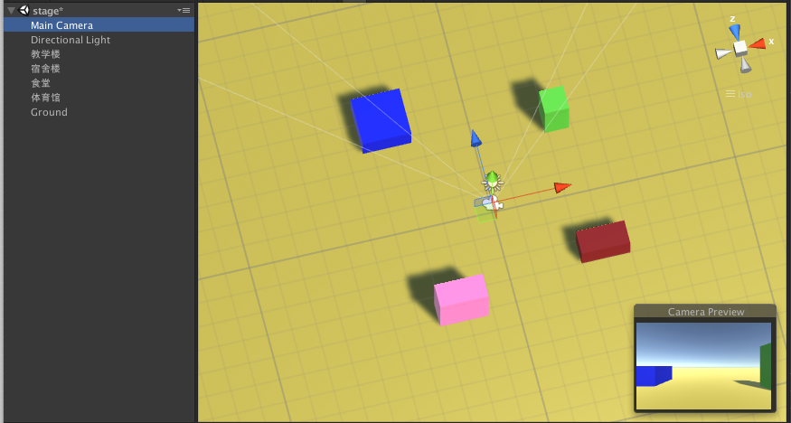
2. 将相机变成VR的双摄像头相机。操作很简单，打开Assets下的GoogleVR下面的，拖动到heriach面板中就可以了。
    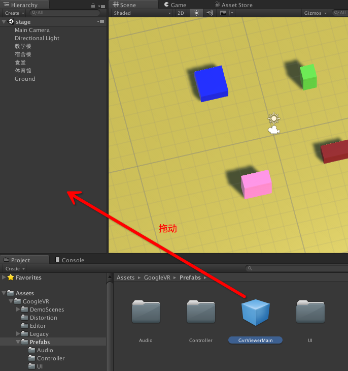
    点击播放按钮，我们就可以看到VR效果了。平移（option+鼠标滑动），倾斜（control+鼠标滑动）
    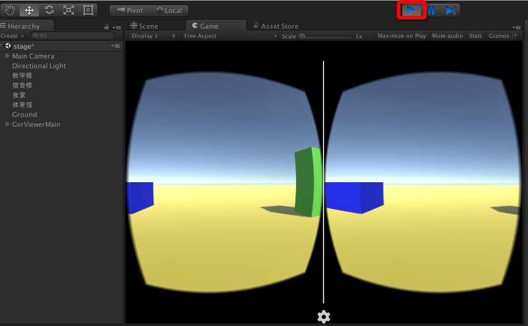

3. 为了方面显示，我们给相机添上焦点。将"Assets/GoogleVR/Prefabs/UI"的GvrReticle拖动到摄像机中。在次点击play按钮，可以看到视频中心有一个焦点。
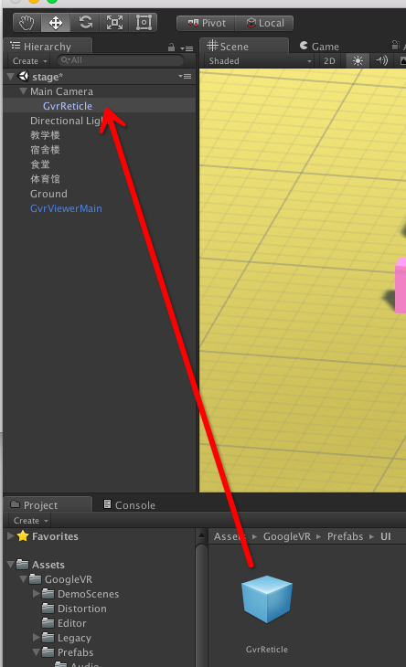 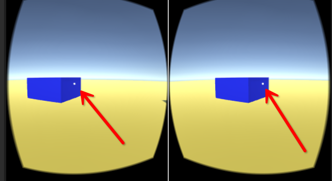

### 3.4 编写游戏脚本
现在，指示建筑物显示名称的功能还没有实现。需要我们用C#编写点脚本，不太难，照着做就好了:

1. 拖入文件夹Google/Scripts/UI中的GvrGaze脚本至相机,这样相机就拥有和物体交互的能力了。是不是很简单?
 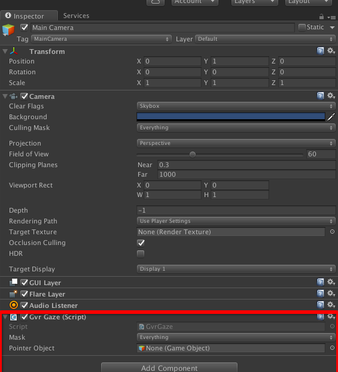 

2. 我们还需要为建筑物添加点代码，让相机照射物体上后物体能够有所反应：

     * 请在MyAssets下面创建一个Scripts文件夹，如图：
      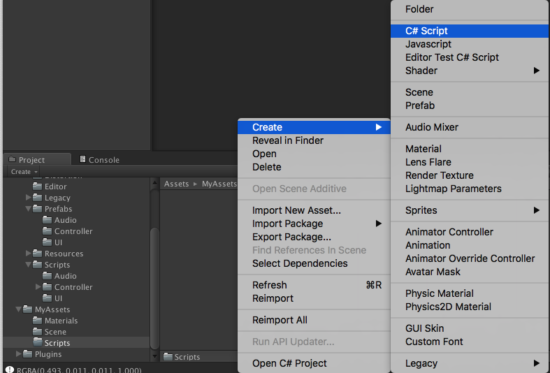 
     
     * 在Scripts创建一个名为Building的C#脚本。
      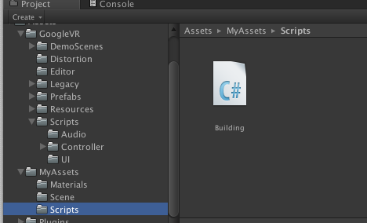 
     
     * 双击点开后，将下面的代码全部覆盖过去：

         ````
            using UnityEngine;
            using System.Collections;

            //除了继承了Unity自带的MonoBehaviour外，还继承了GoogleVR的IGvrGazeResponder的接口类，用于实现物体对相机照射后的反馈动作。
            public class Building : MonoBehaviour,IGvrGazeResponder {

                private Color startColor;
                private Color newColor;

                void Start () {
                    //获取初始的颜色
                    startColor = GetComponent<Renderer>().material.color;
                    //模拟器的console打印颜色信息；
                    Debug.Log(startColor);
                }

                // Update is called once per frame
                void Update () {
                
                }

                //当用户注视物体时的主要业务逻辑
                public void SetGazedAt(bool gazedAt) {
                    if (gazedAt) {
                        TriggerColorToGreen (true); 
                        TellMyName (true);
                    } else {
                        TriggerColorToGreen (false);
                        TellMyName (false);
                    }
                }

                //颜色改变触发器，true 变绿色，false 恢复初始值
                public void TriggerColorToGreen (bool triggered) {
                    GetComponent<Renderer> ().material.color = triggered ? Color.green : startColor;
                }

                //说出该对象的名称
                public void TellMyName (bool asked) {
                    if (asked) {
                        Debug.Log (name);
                    } else {
                        Debug.Log ("don‘t tell you");
                    }
                }


            #region 这里实现IGvrGazeResponder要求的方法

                //焦点注视物体的时候执行
                public void OnGazeEnter(){
                    SetGazedAt(true);
                    Debug.Log (name);
                }

                //焦点已开物体的时候执行
                public void OnGazeExit(){
                    SetGazedAt (false);
                    Debug.Log ("out");
                }
                //点击眼镜盒的触发器，也就是触摸屏幕的时候
                public void OnGazeTrigger(){
                    Debug.Log ("触发");
                }
            #endregion
            }

         ````

     * 将Building给建筑物：
       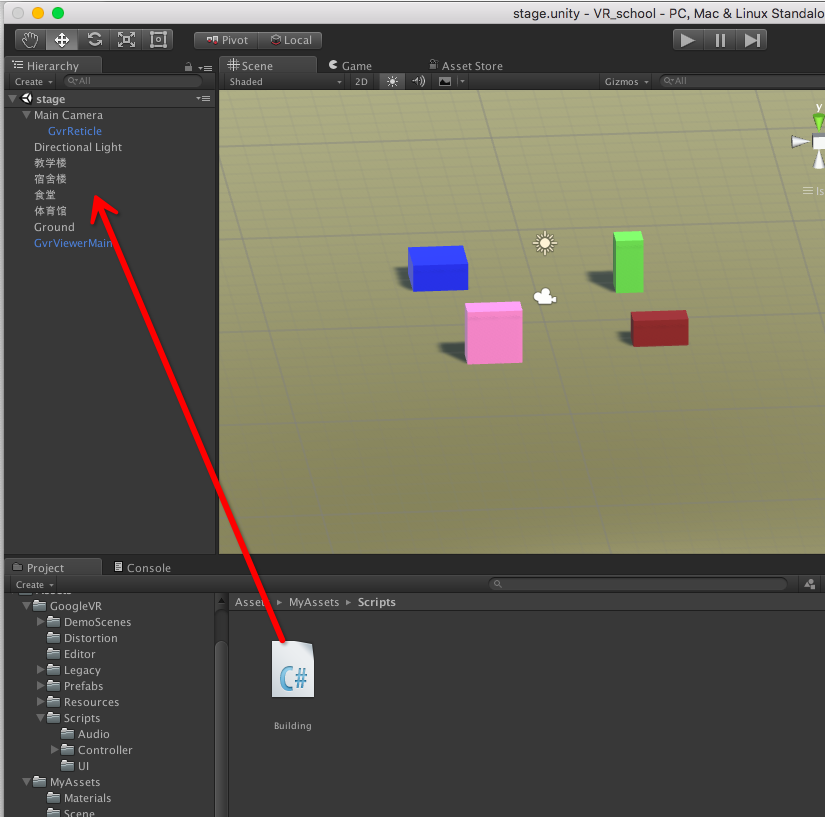 
     * 点击Play按钮就可以看到效果了，大家可以看到焦点对准的物体都会变成绿色，焦点移开后又变成原来的颜色；
       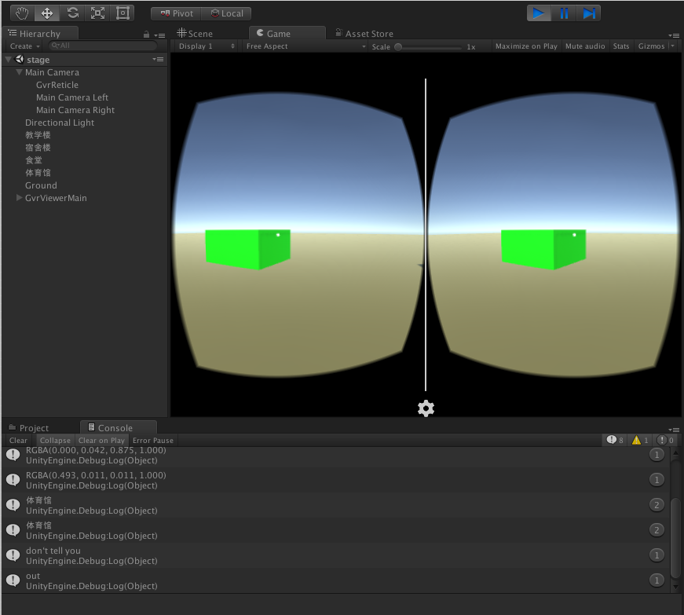 
     
    
3. 大功即将搞成了，现在要做的就是把所看到的物体名字显示在屏幕上

   *  创建GUI文字：将其命名为Building Name，用来呈现建筑物的名称。
       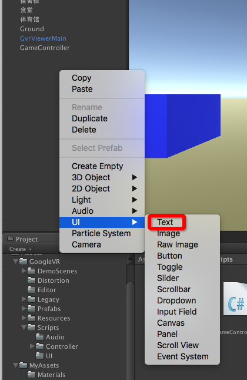 
       调整距离；
       
   * 创建一个空的游戏对象，命名为GameController,设置Tag为GameController，这样Building的代码中就能找到它了。
     
       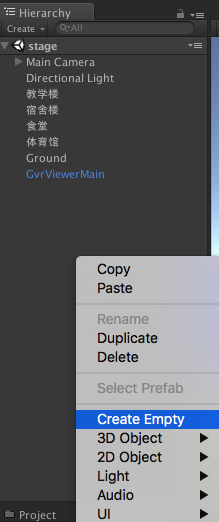 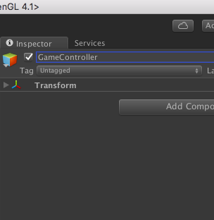

       
       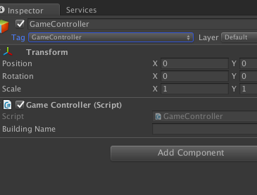 

   * 创建GameController脚本，代码如下：

       ````
            using UnityEngine;
            using UnityEngine.UI;//引入GUI
            using System.Collections;
            public class GameController : MonoBehaviour {
                // 显示文字
                public Text buildingName;
                //画布上显示文字
                public void showBuildingName(string name){
                    buildingName.text =  name;
                }
            }
       ````
       
    * 拖动GameController脚本给GameController对象：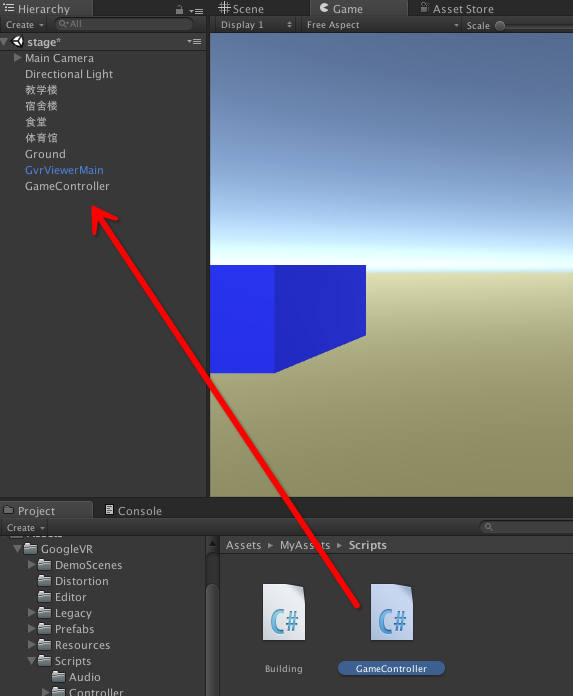 


    * 调整Building代码与GameController交互使建筑物能改变画布的文字，具体代码可以查看gitlab
       * 添加一个私有属性 gameController
     
       ````
	     private GameController gameController;
      
       ````
       
       * 调整Start的代码，添加通过Tag找到游戏中的GameController，并且创建实例。
       
       ````
        //获取Game Controller对象
        GameObject gameControllerObject = GameObject.FindWithTag("GameController");
        if (gameControllerObject != null) {
          gameController = gameControllerObject.GetComponent<GameController>();
        } else {
          Debug.Log("Cannot find 'GameController' script");
        }
       
       ````
       
       * 调整TellMyName的方法，调用将本建筑物的名字传给gameController对象，让它去修改画布。
       
       
       ````
       	//说出本对象的名称
        public void TellMyName (bool asked) {
          if (asked) {
            gameController.showBuildingName (this.name);

          } else {
            Debug.Log ("don‘t tell you");
          }
        }

       ````
       
    * 点击play按钮，查看效果


### 3.5 在iPhone上体验
做完这一步就大功告成了。在第一次导出到手机时要做以下这些操作：

1. 打开File菜单下的 Building Setting 
2. 选择iOS，点击Switch Platform按钮。
3. 点击Player Settings，在屏幕右边的Inspector 选择 Resolution and Presentation 一栏，将Default Orientation设置为Auto Rotation，将Allowed Orientations for Auto Rotation的其他√都去掉只保留Landscape Left;
  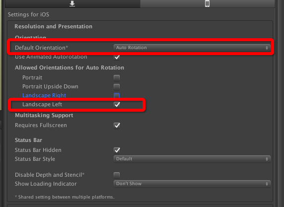
  
4. 点击最下方的Other Setting，找到Bundle Identifier 将它设置成你的苹果开发者认证的账号的ID；如果没有的话，需要到苹果开发者上去设置。您可查看Xcode如何在真机上调试的一些资料。
  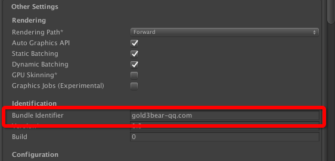

5. 插上手机 点击Build and Run 就耐心等待就好了，在过程中Unity会调用Xcode请点击确定。


## 四、总结
总的来说使用Cardboard的来制作VR是较为简单和低成本的。随着VR技术的不断发展，更多优质的解决方案会不断涌现出来，因此，这是一个需要持续学习和研究的过程。虽然这次课题的研究结束了，但是对于易班的VR研究才刚刚开始，

